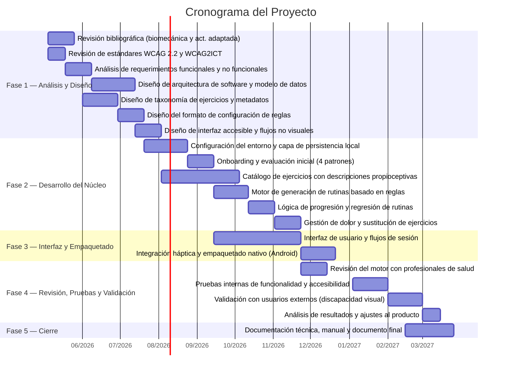

# Diagrama de Gantt — Cronograma del Proyecto

```mermaid
gantt
    title Cronograma del Proyecto
    dateFormat  YYYY-MM-DD
    axisFormat  %m/%Y
    tickInterval 1month

    section Fase 1 — Análisis y Diseño
        Revisión bibliográfica (biomecánica y act. adaptada)    :a1,  2026-05-04, 21d
        Revisión de estándares WCAG 2.2 y WCAG2ICT             :a2,  2026-05-04, 14d
        Análisis de requerimientos funcionales y no funcionales :a3,  2026-05-18, 21d
        Diseño de arquitectura de software y modelo de datos    :a4,  2026-06-08, 35d
        Diseño de taxonomía de ejercicios y metadatos           :a5,  2026-06-01, 28d
        Diseño del formato de configuración de reglas           :a6,  2026-06-29, 21d
        Diseño de interfaz accesible y flujos no visuales       :a7,  2026-07-13, 21d

    section Fase 2 — Desarrollo del Núcleo
        Configuración del entorno y capa de persistencia local  :a8,  2026-07-20, 35d
        Onboarding y evaluación inicial (4 patrones)            :a9,  2026-08-24, 21d
        Catálogo de ejercicios con descripciones propioceptivas :a10, 2026-08-03, 63d
        Motor de generación de rutinas basado en reglas         :a11, 2026-09-14, 28d
        Lógica de progresión y regresión de rutinas             :a12, 2026-10-12, 21d
        Gestión de dolor y sustitución de ejercicios            :a13, 2026-11-02, 21d

    section Fase 3 — Interfaz y Empaquetado
        Interfaz de usuario y flujos de sesión                  :a14, 2026-09-14, 70d
        Integración háptica y empaquetado nativo (Android)      :a15, 2026-11-23, 28d

    section Fase 4 — Revisión, Pruebas y Validación
        Revisión del motor con profesionales de salud           :a16, 2026-11-23, 21d
        Pruebas internas de funcionalidad y accesibilidad       :a17, 2027-01-04, 28d
        Validación con usuarios externos (discapacidad visual)  :a18, 2027-02-01, 28d
        Análisis de resultados y ajustes al producto            :a19, 2027-03-01, 14d

    section Fase 5 — Cierre
        Documentación técnica, manual y documento final         :a20, 2027-02-15, 2027-03-26
```
