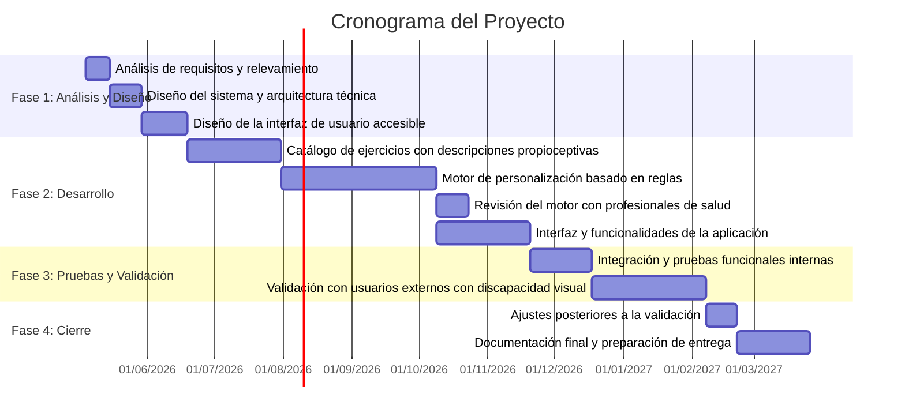

# Diagrama de Gantt — Cronograma del Proyecto

*Nota.* Las barras muestran las dependencias entre actividades. La revisión con profesionales de salud (a8) depende únicamente del motor de reglas (a5) y puede ejecutarse en paralelo con el desarrollo de la interfaz (a6); ambas son independientes entre sí. La validación con usuarios (a9) requiere que tanto las pruebas internas (a7) como la revisión profesional (a8) estén completadas. El cronograma puede estar sujeto a ajustes según el avance real del proyecto.
