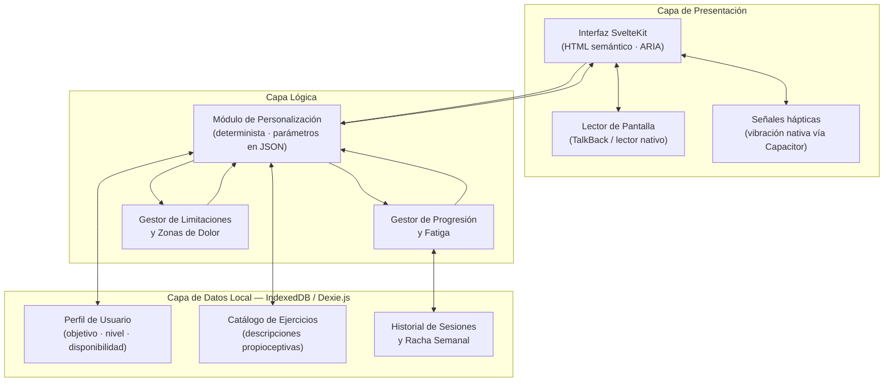

# Arquitectura de módulos del sistema

```mermaid
graph TD
    subgraph UI["Capa de Presentación"]
        SK["Interfaz SvelteKit\n(HTML semántico · ARIA)"]
        LP["Lector de Pantalla\n(TalkBack / lector nativo)"]
        HAP["Señales hápticas\n(vibración nativa vía Capacitor)"]
    end

    subgraph LOGIC["Capa Lógica"]
        MR["Módulo de Personalización\n(determinista · parámetros en JSON)"]
        GP["Gestor de Progresión\ny Fatiga"]
        GL["Gestor de Limitaciones\ny Zonas de Dolor"]
    end

    subgraph DATA["Capa de Datos Local — IndexedDB / Dexie.js"]
        PF["Perfil de Usuario\n(objetivo · nivel · disponibilidad)"]
        CAT["Catálogo de Ejercicios\n(descripciones propioceptivas)"]
        HIST["Historial de Sesiones\ny Racha Semanal"]
    end

    SK <--> LP
    SK <--> HAP
    SK --> MR
    MR --> GP
    MR --> GL
    GP --> MR
    GL --> MR
    MR --> SK
    MR <--> PF
    MR <--> CAT
    GP <--> HIST
```
