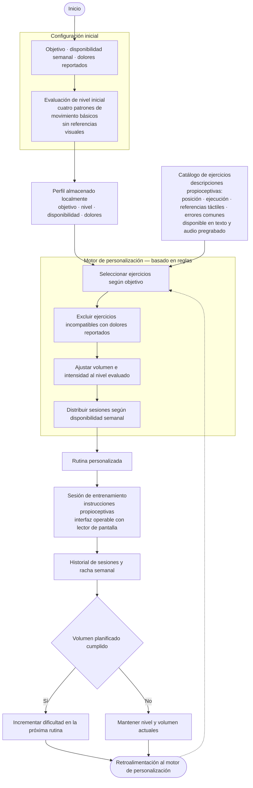

# Diagrama de Flujo

```mermaid
flowchart TD
    A([Inicio]) --> B

    subgraph S1["Configuración inicial"]
        B["Objetivo · disponibilidad semanal · dolores reportados"]
        B --> C["Evaluación de nivel inicial
        cuatro patrones de movimiento básicos
        sin referencias visuales"]
    end

    C --> D["Perfil almacenado localmente
    objetivo · nivel · disponibilidad · dolores"]

    CAT["Catálogo de ejercicios
    descripciones propioceptivas:
    posición · ejecución · referencias táctiles · errores comunes
    disponible en texto y audio pregrabado"]

    D --> SEL
    CAT --> SEL

    subgraph S2["Motor de personalización — basado en reglas"]
        SEL["Seleccionar ejercicios según objetivo"]
        SEL --> EXC["Excluir ejercicios incompatibles con dolores reportados"]
        EXC --> AJU["Ajustar volumen e intensidad al nivel evaluado"]
        AJU --> DIS["Distribuir sesiones según disponibilidad semanal"]
    end

    DIS --> RUT["Rutina personalizada"]
    RUT --> SES["Sesión de entrenamiento
    instrucciones propioceptivas
    interfaz operable con lector de pantalla"]
    SES --> HIST["Historial de sesiones y racha semanal"]
    HIST --> DEC{Volumen planificado cumplido}
    DEC -- Sí --> INC["Incrementar dificultad en la próxima rutina"]
    DEC -- No --> MAN["Mantener nivel y volumen actuales"]
    INC --> FB([Retroalimentación al motor de personalización])
    MAN --> FB
    FB -.-> SEL
```
